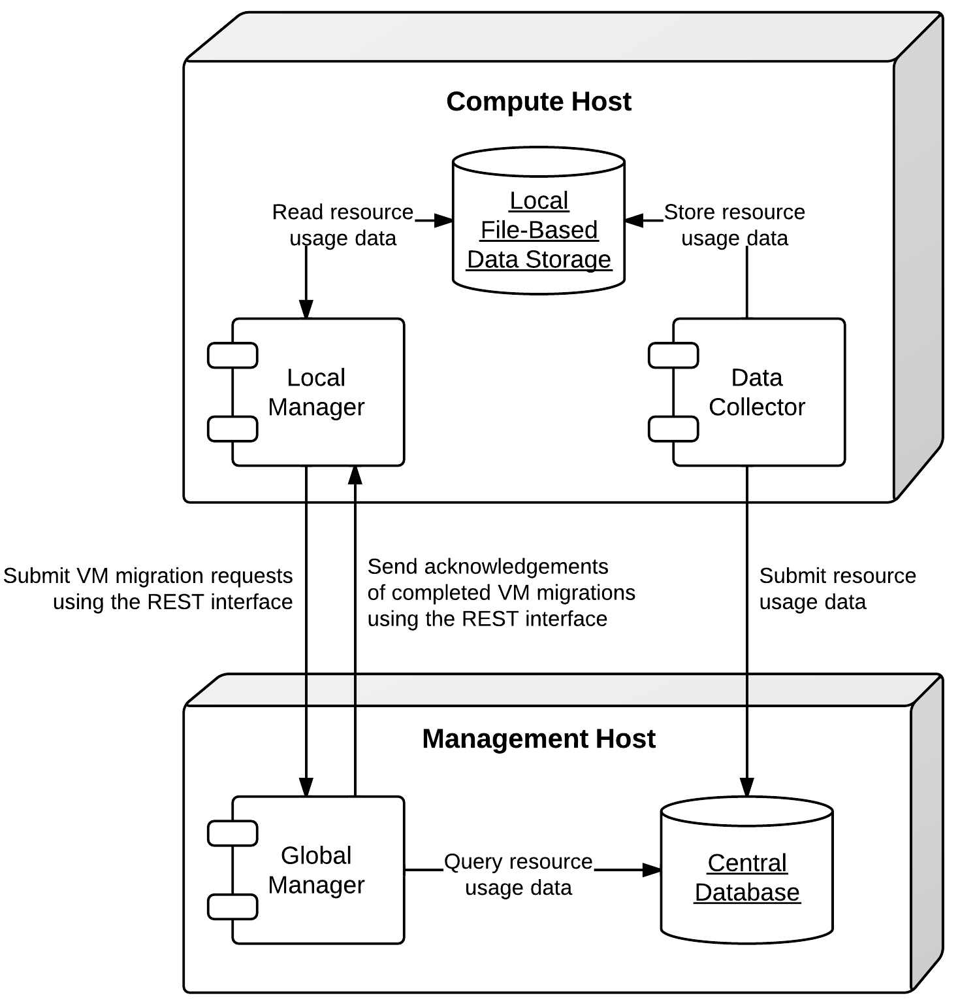
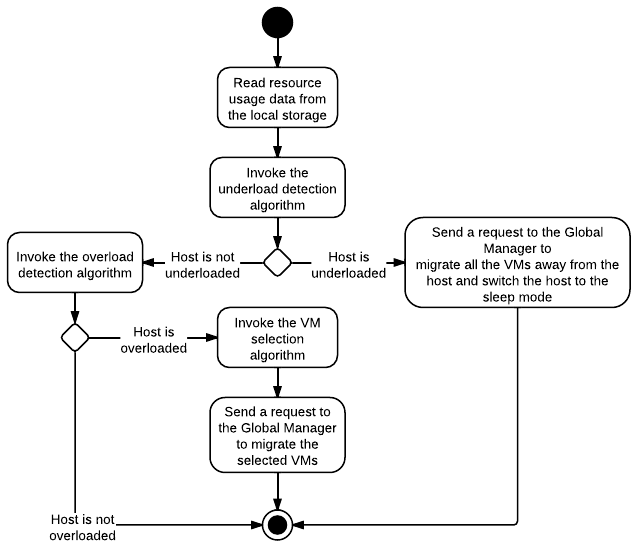

% OpenStack Neat: A Framework for Dynamic Consolidation of Virtual Machines in OpenStack Clouds
% Anton Beloglazov; Rajkumar Buyya
% 14th of August 2012


# Summary

OpenStack Neat is a project intended to provide an extension to OpenStack implementing dynamic
consolidation of Virtual Machines (VMs) using live migration. The major objective of dynamic VM
consolidation is to improve the utilization of physical resources and reduce energy consumption by
re-allocating VMs using live migration according to their real-time resource demand and switching
idle hosts to the sleep mode. For example, assume that two VMs are placed on two different hosts,
but the combined resource capacity required by the VMs to serve the current load can be provided by
just one of the hosts. Then, one of the VMs can be migrated to the host serving the other VM, and
the idle host can be switched to a low power mode to save energy.

Apart from consolidating VMs, the system should be able to react to increases in the resource demand
and deconsolidate VMs when necessary to avoid performance degradation. In general, the problem of
dynamic VM consolidation can be split into 4 sub-problems:

1. Deciding when a host is considered to be underloaded, so that all the VMs should be migrated from
it, and the host should be switched to a low power mode, such as the sleep mode.
2. Deciding when a host is considered to be overloaded, so that some VMs should be migrated from the
host to other hosts to avoid performance degradation.
3. Selecting VMs to migrate from an overloaded host out of the full set of the VMs currently served
by the host.
4. Placing VMs selected for migration to other active or re-activated hosts.

This work is conducted within the
[Cloud Computing and Distributed Systems (CLOUDS) Laboratory](http://www.cloudbus.org/) at the
University of Melbourne. The problem of dynamic VM consolidation considering Quality of Service
(QoS) constraints has been studied from the theoretical perspective and algorithms addressing the
sub-problems listed above have been proposed [@beloglazov2012optimal; @beloglazov2012overload]. The
algorithms have been evaluated using [CloudSim](http://code.google.com/p/cloudsim/) and real-world
workload traces collected from more than a thousand [PlanetLab](https://www.planet-lab.org/) VMs
hosted on servers located in more than 500 places around the world.

The aim of the OpenStack Neat project is to provide an extensible framework for dynamic
consolidation of VMs based on the OpenStack platform. The framework should provide an infrastructure
enabling the interaction of components implementing the 4 decision-making algorithms listed above.
The framework should allow configuration-driven switching of different implementations of the
decision-making algorithms. The implementation of the framework will include the algorithms proposed
in our previous works [@beloglazov2012optimal; @beloglazov2012overload].


# Release Note

The functionality covered by this project will be implemented in the form of services separate from
the core OpenStack services. The services of this project will interact with the core OpenStack
services using their public APIs. It will be required to create a new Keystone user within the
`service` tenant. The project will also require a new MySQL database for storing historical data on
the resource usage by VMs. The project will provide a script for automated initialization of the
database. The services provided by the project will need to be run on the management as well as
compute hosts.


# Rationale

The problem of data center operation is high energy consumption, which has risen by 56% from 2005 to
2010, and in 2010 accounted to be between 1.1% and 1.5% of the global electricity use
[@koomey2011growth]. Apart from high operating costs, this results in substantial carbon dioxide
(CO~2~) emissions, which are estimated to be 2% of the global emissions [@gartner2007co2]. The
problem has been partially addressed by improvements in the physical infrastructure of modern data
centers. As reported by the [Open Compute Project](http://opencompute.org/), Facebook's Oregon data
center achieves a Power Usage Effectiveness (PUE) of 1.08, which means that approximately 93% of the
data center's energy consumption are consumed by the computing resources. Therefore, now it is
important to focus on the resource management aspect, i.e. ensuring that the computing resources are
efficiently utilized to serve applications.

Dynamic consolidation of VMs has been shown to be efficient in improving the utilization of data
center resources and reducing energy consumption, as demonstrated by numerous studies
[@nathuji2007virtualpower; @verma2008pmapper; @zhu20081000; @gmach2008integrated; @gmach2009resource;
@vmware2010distributed; @jung2010mistral; @zheng2009justrunit; @kumar2009vmanage; @guenter2011managing;
@bobroff2007dynamic; @beloglazov2011taxonomy]. In this project, we aim to implement an extensible
framework for dynamic VM consolidation specifically targeted at the OpenStack platform.


# User stories

- As a Cloud Administrator or Systems Integrator, I want to support dynamic VM consolidation to
  improve the utilization of the data center's resources and reduce energy consumption.
- As a Cloud Administrator, I want to minimize the price of the service provided to the consumers by
  reducing the operating costs through the reduced energy consumption.
- As a Cloud Administrator, I want to decrease the carbon dioxide emissions into the environment by
  reducing energy consumption by the data center's resources.
- As a Cloud Administrator, I want to provide QoS guarantees to the consumers, while applying
  dynamic VM consolidation.
- As a Cloud Service Consumer, I want to pay the minimum price for the service provided through the
  minimized energy consumption of the computing resources.
- As a Cloud Service Consumer, I want to use Green Cloud resources, whose provider strives to reduce
  the impact on the environment in terms of carbon dioxide emissions.


# Assumptions

- Nova uses a *shared storage* for storing VM instance data, thus supporting *live migration* of
  VMs. For example, a shared storage can be provided using Network File System (NFS), or GlusterFS
  as described in [@beloglazov2012openstack].
- All the compute hosts must have a user, which is enabled to switch the machine into the sleep
  mode, which is also referred to as "Suspend to RAM". This user is used by the global controller to
  connect to the compute hosts using SSH and switch them into the sleep mode when necessary.


# Design



The system is composed of a number of components and data stores, some of which are deployed on the
compute hosts, and some on the management host (Figure 1). In the following sections, we discuss the
design and interaction of the components, as well as the specification of the data stores, and
available configuration options.


## Components

As shown in Figure 1, the system is composed of three main components:

- *Global manager* -- a component that is deployed on the management host and makes global
   management decisions, such as mapping VM instances on hosts, and initiating VM migrations.
- *Local manager* -- a component that is deployed on every compute host and makes local decisions,
   such as deciding that the host is underloaded or overloaded, and selecting VMs to migrate to
   other hosts.
- *Data collector* -- a component that is deployed on every compute host and is responsible for
   collecting data about the resource usage by VM instances, as well as storing these data locally
   and submitting the data to the central database.


### Global Manager


The global manager is deployed on the management host and is responsible for making VM placement
decisions and initiating VM migrations. It exposes a REST web service, which accepts requests from
local managers. The global manager processes only one type of requests -- reallocation of a set of
VM instances. As shown in Figure 2, once a request is received, the global manager invokes a VM
placement algorithm to determine destination hosts to migrate the VMs to. Once a VM placement is
determined, the global manager submits a request to the Nova API to migrate the VMs. The global
manager is also responsible for switching idle hosts to the sleep mode, as well as re-activating
hosts when necessary.


#### VM Placement.

The global manager is agnostic of a particular implementation of the VM placement algorithm in use.
The VM placement algorithm to use can be specified in the configuration file described later using
the `algorithm_vm_placement` option. A VM placement algorithm can call the Nova API to obtain the
information about host characteristics and current VM placement. If necessary, it can also query the
central database to obtain the historical information about the resource usage by the VMs.


#### REST API.

The global manager exposes a REST web service (REST API) for accepting VM migration requests from
local managers. The service URL is defined according to configuration options defined in
`/etc/neat/neat.conf`, which is discussed further in the paper. The two relevant options are:

- `global_manager_host` -- the name of the host running the global manager;
- `global_manager_port` -- the port of the REST web service exposed by the global manager.

The service URL is composed as follows:

```
http://<global_manager_host>:<global_manager_port>/
```

Since the global manager processes only a single type of requests, it exposes only one resource:
`/`. The resource is accessed using the `PUT` method, which initiates a VM reallocation process.
This service requires the following parameters:

- `admin_tenant_name` -- the admin tenant name of Neat's admin user registered in Keystone. In this
  context, this parameter is not used to authenticate in any OpenStack service, rather it is used to
  authenticate the client making a request as being allowed to access the web service.
- `admin_user` -- the admin user name of Neat's admin user registered in Keystone. In this context,
  this parameter is not used to authenticate in any OpenStack service, rather it is used to
  authenticate the client making a request as being allowed to access the web service.
- `admin_password` -- the admin password of Neat's admin user registered in Keystone. In this
  context, this parameter is not used to authenticate in any OpenStack service, rather it is used to
  authenticate the client making a request as being allowed to access the web service.
- `vm_uuids` -- a coma-separated list of UUIDs of the VMs required to be migrated.
- `reason` -- an integer specifying the resource for migration: 0 -- underload, 1 -- overload.

If the provided credentials are correct and the `vm_uuids` parameter includes a list of UUIDs of
existing VMs in the correct format, the service responses with the HTTP status code `200 OK`.

The service uses standard HTTP error codes to response in cases of errors detected. The following
error codes are used:

- `400` -- bad input parameter: incorrect or missing parameters;
- `401` -- unauthorized: user credentials are missing;
- `403` -- forbidden: user credentials do not much the ones specified in the configuration file;
- `405` -- method not allowed: the request is made with a method other than the only supported
  `PUT`;
- `422` -- unprocessable entity: one or more VMs could not be found using the list of UUIDs
  specified in the `vm_uuids` parameter.


#### Switching Hosts On and Off.

One of the main features required to be supported by the hardware in order to take advantage of
dynamic VM consolidation to save energy is [Wake-on-LAN](http://en.wikipedia.org/wiki/Wake-on-LAN).
This technology allows a computer being in the sleep (Suspend to RAM) mode to be re-activated by
sending a special packet over network. This technology has been introduced in 1997 by the Advanced
Manageability Alliance (AMA) formed by Intel and IBM, and is currently supported by most of the
modern hardware.

Once the required VM migrations are completed, the global manager connects to the source host and
switches into in the Suspend to RAM mode. Switching to the Suspend to RAM mode can be done, for
example, using programs included in the `pm-utils` package. To check whether the Suspend to RAM mode
is supported, the following command can be used:

```Bash
pm-is-supported --suspend
```

The Suspend to RAM mode is supported if the command returns 0, otherwise it is not supported. In
this case, the Suspend to RAM mode can be replaced with the Standby or Suspend to Disk (Hibernate)
modes. The following command can be used to switch the host into the Suspend to RAM mode:

```Bash
pm-suspend
```

To re-activate a host using the Wake-on-LAN technology, it is necessary to send a special packet,
called the *magic packet*. This can be done using the `ether-wake` program as follows:

```Bash
ether-wake <mac address>
```

Where `<mac address>` is replaced with the actual MAC address of the host.


### Local Manager



The local manager component is deployed on every compute host and is invoked periodically to
determine when it necessary to reallocate VM instances from the host. A high-level view of the
workflow performed by the local manager is shown in Figure 3. First of all, it reads from the local
storage the historical data on the resource usage by VMs stored by the data collector described in
the next section. Then, the local manager invokes the specified in the configuration underload
detection algorithm to determine whether the host is underloaded. If the host is underloaded, the
local manager sends a request to the global manager's REST API to migrate all the VMs from the host
and switch the host to the sleep mode.

If the host is not underloaded, the local manager proceeds to invoking the specified in the
configuration overload detection algorithm. If the host is overloaded, the local manager invokes the
configured VM selection algorithm to select the VMs to migrate from the host. Once the VMs to
migrate from the host are selected, the local manager sends a request to the global manager's REST
API to migrate the selected VMs from the host.

Similarly to the global manager, the local manager can be configured to use specific underload
detection, overload detection, and VM selection algorithm using the configuration file discussed
further in the paper.


#### Underload Detection.

Underload detection is done by a specified in the configuration underload detection algorithm
(`algorithm_underload_detection`). The algorithm has a pre-defined interface, which allows
substituting different implementations of the algorithm. The configured algorithm is invoked by the
local manager and accepts historical data on the resource usage by VMs running on the host as an
input. An underload detection algorithm returns a decision of whether the host is underloaded.


#### Overload Detection.

Overload detection is done by a specified in the configuration overload detection algorithm
(`algorithm_overload_detection`). Similarly to underload detection, all overload detection
algorithms implement a pre-defined interface to enable configuration-driven substitution of
difference implementations. The configured algorithm is invoked by the local manager and accepts
historical data on the resource usage by VMs running on the host as an input. An overload detection
algorithm returns a decision of whether the host is overloaded.


#### VM Selection.

If a host is overloaded, it is necessary to select VMs to migrate from the host to avoid performance
degradation. This is done by a specified in the configuration VM selection algorithm
(`algorithm_vm_selection`). Similarly to underload and overload detection algorithms, different VM
selection algorithm can by plugged in according to the configuration. A VM selection algorithm
accepts historical data on the resource usage by VMs running on the host and returns a set of VMs to
migrate from the host.


### Data Collector

The data collector is deployed on every compute host and is executed periodically to collect the CPU
utilization data for each VM running on the host and stores the data in the local file-based data
store. The data is stored as the average number of MHz consumed by a VM during the last measurement
interval. The CPU usage data are stored as integers. This data format is portable: the stored values
can be converted to the CPU utilization for any host or VM type, supporting heterogeneous hosts and
VMs.

The actual data is obtained from Libvirt in the form of the CPU time consumed by a VM to date. Using
the CPU time collected at the previous time frame, the CPU time for the past time interval is
calculated. According to the CPU frequency of the host and the length of the time interval, the CPU
time is converted into the required average MHz consumed by the VM over the last time interval. The
collected data are stored both locally and submitted to the central database. The number of the
latest data values stored locally and passed to the underload / overload detection and VM selection
algorithms is defined using the `data_collector_data_length` option in the configuration file.

At the beginning of every execution, the data collector obtains the set of VMs currently running on
the host using the Nova API and compares them to the VMs running on the host at the previous time
step. If new VMs have been found, the data collector fetches the historical data about them from the
central database and stores the data in the local file-based data store. If some VMs have been
removed, the data collector removes the data about these VMs from the local data store.


## Data Stores

As shown in Figure 1, the system contains two types of data stores:

- *Central database* -- a database deployed on the management host.
- *Local file-based data storage* -- a data store deployed on every compute host and used for
   storing resource usage data to use by local managers.

The details about the data stores are given in the following subsections.


### Central Database

The central database is used for storing historical data on the resource usage by VMs running on all
the compute hosts. The database is populated by data collectors deployed on the compute hosts. The
data are consumed by VM placement algorithms. The database contains two tables: `vms` and
`vm_resource_usage`.

The `vms` table is used for storing the mapping between UUIDs of VMs and the internal database IDs:

```
CREATE TABLE vms (
	# the internal ID of a VM
    id BIGINT UNSIGNED NOT NULL AUTO_INCREMENT,
	# the UUID of the VM
    uuid CHAR(36) NOT NULL,
    PRIMARY KEY (id)
) ENGINE=MyISAM;
```

The `vm_resource_usage` table is used for storing the data about the resource usage by VMs:

```
CREATE TABLE vm_resource_usage (
	# the ID of the record
    id BIGINT UNSIGNED NOT NULL AUTO_INCREMENT,
	# the id of the corresponding VM
    vm_id BIGINT UNSIGNED NOT NULL,
	# the time of the data collection
	timestamp TIMESTAMP NOT NULL,
	# the average CPU usage in MHz
    cpu_mhz MEDIUMINT UNSIGNED NOT NULL,
    PRIMARY KEY (id)
) ENGINE=MyISAM;
```


### Local File-Based Data Store

The data collector stores the resource usage information locally in files in the
`<local_data_directory>/vm` directory, where `<local_data_directory>` is defined in the
configuration file using the `local_data_directory` option. The data for each VM are stored in a
separate file named according to the UUID of the corresponding VM. The format of the files is a new
line separated list of integers representing the average CPU consumption by the VMs in MHz during
the last measurement interval.


## Configuration File

The configuration of OpenStack Neat is stored in `/etc/neat/neat.conf` in the standard INI format
using the `#` character for denoting comments. The configuration includes the following options:

- `sql_connection` -- the host name and credentials for connecting to the MySQL database specified
  in the format supported by SQLAlchemy;
- `admin_tenant_name` -- the admin tenant name for authentication with Nova using Keystone;
- `admin_user` -- the admin user name for authentication with Nova using Keystone;
- `admin_password` -- the admin password for authentication with Nova using Keystone;
- `global_manager_host` -- the name of the host running the global manager;
- `global_manager_port` -- the port of the REST web service exposed by the global manager;
- `local_data_directory` -- the directory used by the data collector to store the data on the resource
  usage by the VMs running on the host (the default value is `/var/lib/neat`);
- `local_manager_interval` -- the time interval between subsequent invocations of the local manager
  in seconds;
- `data_collector_interval` -- the time interval between subsequent invocations of the data
  collector in seconds;
- `data_collector_data_length` -- the number of the latest data values stored locally by the data
  collector and passed to the underload / overload detection and VM placement algorithms;
- `compute_user` -- the user name for connecting to the compute hosts to switch them into the sleep
  mode;
- `compute_password` -- the password of the user account used for connecting to the compute hosts to
  switch them into the sleep mode;
- `sleep_command` -- a shell command used to switch a host into the sleep mode, the `compute_user`
  must have permissions to execute this command (the default value is `pm-suspend`);
- `algorithm_underload_detection` -- the fully qualified name of a Python function to use as an
  underload detection algorithm;
- `algorithm_overload_detection` -- the fully qualified name of a Python function to use as an
  overload detection algorithm;
- `algorithm_vm_selection` -- the fully qualified name of a Python function to use as a VM selection
  algorithm;
- `algorithm_vm_placement` -- the fully qualified name of a Python function to use as a VM placement
  algorithm.


# Implementation

This section describes a plan of how the components described above are going to be implemented.


## Libraries

The following third party libraries are planned to be used to implement the required components:

1. [distribute](https://bitbucket.org/tarek/distribute) -- a library for working with Python
   module distributions, released under the Python Software Foundation License.
2. [pyqcy](https://github.com/Xion/pyqcy) -- a QuickCheck-like testing framework for Python,
   released under the FreeBSD License.
3. [mocktest](https://github.com/gfxmonk/mocktest) -- a mocking library for Python, released under
   the LGPL License.
4. [PyContracts](https://github.com/AndreaCensi/contracts) -- a Python library for Design by
   Contract (DbC), released under the GNU Lesser General Public License.
5. [SQLAlchemy](http://www.sqlalchemy.org/) -- a Python SQL toolkit and Object Relational Mapper
   (used by the core OpenStack service), released under the MIT License.
6. [Bottle](http://bottlepy.org/) -- a micro web-framework for Python, authentication using the same
   credentials used to authenticate in the Nova API, released under the MIT License.
7. [Requests](http://python-requests.org/) -- a Python HTTP client library, released under the ISC
   License.
8. [python-novaclient](https://github.com/openstack/python-novaclient) -- a Python Nova API client
   implementation, released under the Apache 2.0 License.
9. [Sphinx](http://sphinx.pocoo.org/) -- a documentation generator for Python, released under the
   BSD License.


## Global Manager

The global manager component will provide a REST web service implemented using the Bottle framework.
The authentication is going to be done using the admin credentials specified in the configuration
file. Upon receiving a request from a local manager, the following steps will be performed:

1. Parse the `vm_uuids` parameter and transform it into a list of UUIDs of the VMs to migrate.
2. Call the Nova API to obtain the current placement of VMs on the hosts.
3. Call the function specified in the `algorithm_vm_placement` configuration option and pass the
   UUIDs of the VMs to migrate and the current VM placement as arguments.
4. Call the Nova API to migrate the VMs according to the placement determined by the
   `algorithm_vm_placement` algorithm.

When a host needs to be switched to the sleep mode, the global manager will use the account
credentials from the `compute_user` and `compute_password` configuration options to open an SSH
connection with the target host and then invoke the command specified in the `sleep_command`, which
defaults to `pm-suspend`.

When a host needs to be re-activated from the sleep mode, the global manager will leverage the
Wake-on-LAN technology and send a magic packet to the target host using the `ether-wake` program and
passing the corresponding MAC address as an argument. The mapping between the IP addresses of the
hosts and their MAC addresses is initialized in the beginning of the global manager's execution.


## Local Manager

The local manager will be implemented as a Linux daemon running in the background and every
`local_manager_interval` seconds checking whether some VMs should be migrated from the host. Every
time interval, the local manager performs the following steps:

1. Read the data on resource usage by the VMs running on the host from the
   `<local_data_directory>/vm` directory.
2. Call the function specified in the `algorithm_underload_detection` configuration option and pass
   the data on the resource usage by the VMs, as well as the frequency of the CPU as arguments.
3. If the host is underloaded, send a request to the REST API of the global manager and pass a list
   of the UUIDs of all the VMs currently running on the host in the `vm_uuids` parameter, as well as
   the `reason` for migration as being 0.
4. If the host is not underloaded, call the function specified in the `algorithm_overload_detection`
   configuration option and pass the data on the resource usage by the VMs, as well as the frequency
   of the host's CPU as arguments.
5. If the host is overloaded, call the function specified in the `algorithm_vm_selection`
   configuration option and pass the data on the resource usage by the VMs, as well as the frequency
   of the host's CPU as arguments
6. If the host is overloaded, send a request to the REST API of the global manager and pass a list
   of the UUIDs of the VMs selected by the VM selection algorithm in the `vm_uuids` parameter, as
   well as the `reason` for migration as being 1.
7. Schedule the next execution after `local_manager_interval` seconds.


## Data Collector

The data collector will be implemented as a Linux daemon running in the background and collecting
data on the resource usage by VMs every `data_collector_interval` seconds. When the data collection
phase is invoked, the component performs the following steps:

1. Read the names of the files from the `<local_data_directory>/vm` directory to determine the list
   of VMs running on the host at the last data collection.
2. Call the Nova API to obtain the list of VMs that are currently active on the host.
3. Compare the old and new lists of VMs and determine the newly added or removed VMs.
4. Delete the files from the `<local_data_directory>/vm` directory corresponding to the VMs that
   have been removed from the host.
5. Fetch the latest `data_collector_data_length` data values from the central database for each
   newly added VM using the database connection information specified in the `sql_connection` option
   and save the data in the `<local_data_directory>/vm` directory.
6. Call the Libvirt API to obtain the CPU time for each VM active on the host.
7. Transform the data obtained from the Libvirt API into the average MHz according to the frequency
   of the host's CPU and time interval from the previous data collection.
8. Store the converted data in the `<local_data_directory>/vm` directory in separate files for each
   VM, and submit the data to the central database.
9. Schedule the next execution after `data_collector_interval` seconds.


# Test/Demo Plan

This need not be added or completed until the specification is nearing beta.


# Unresolved issues

This should highlight any issues that should be addressed in further specifications, and not
problems with the specification itself; since any specification with problems cannot be approved.


# BoF agenda and discussion

Use this section to take notes during the BoF; if you keep it in the approved spec, use it for
summarising what was discussed and note any options that were rejected.


# References
